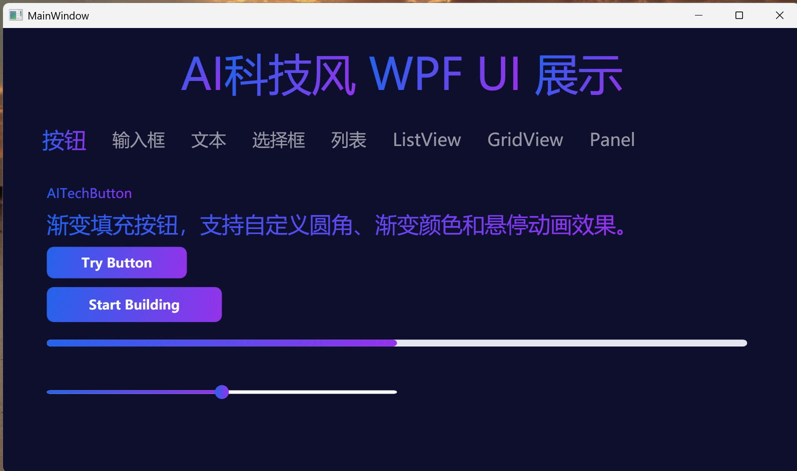
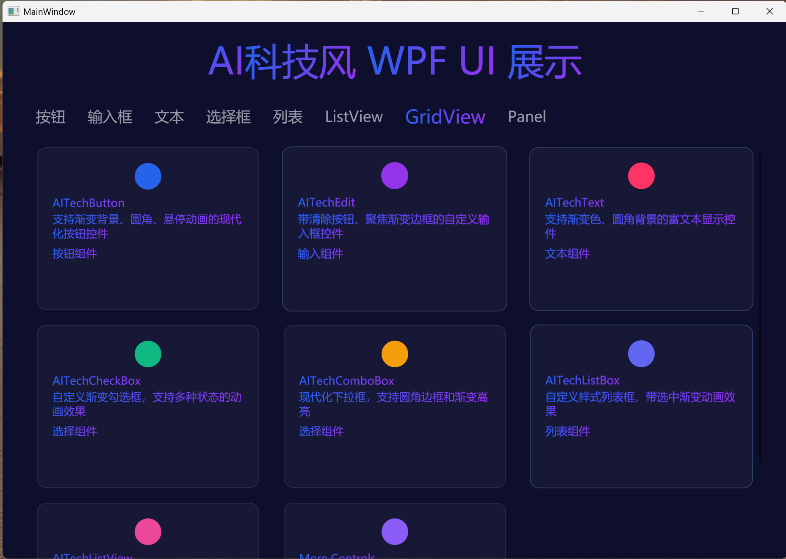
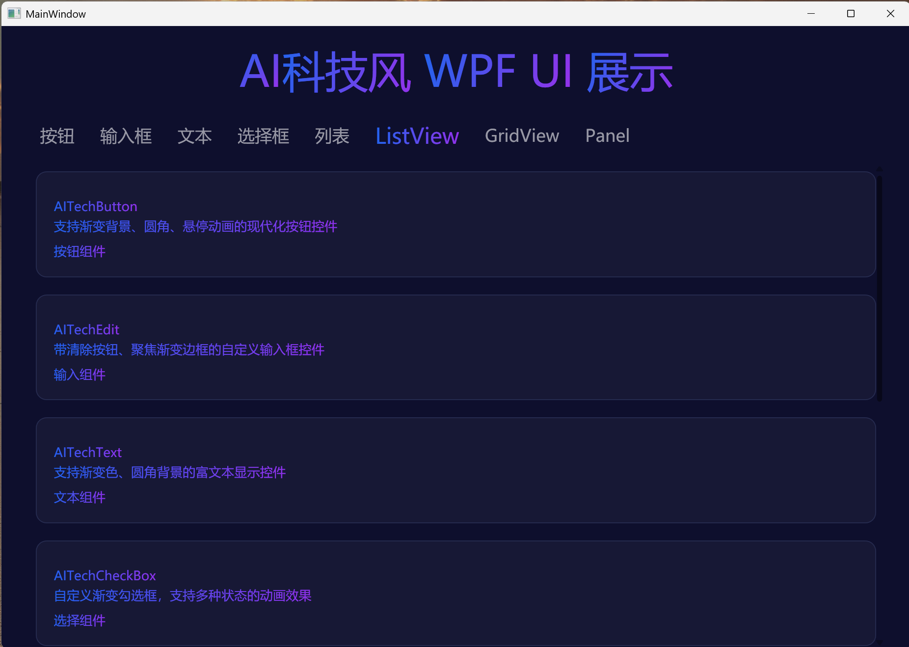

# AITechUI.WPF

一套采用蓝紫渐变设计风格的 WPF 自定义控件库,基于 .NET 10,所有控件的样式与模板均在代码中动态构建,无需 XAML 资源字典引用。



## 项目信息

| 项 | 值 |
|---|---|
| 包名 (NuGet) | `AITechUI.WPF` |
| 命名空间 | `AITechControls` |
| 目标框架 | `net10.0-windows` |
| 作者 | KS.STUDIO |
| WPF 支持 | 启用 (`UseWPF=true`) |



## 设计特点

- **统一品牌色**:蓝紫渐变 `RGB(37,99,235) → RGB(147,51,234)` 贯穿所有控件
- **纯代码构建样式**:使用 `FrameworkElementFactory` + `Binding` + `Trigger` 在 C# 代码中动态生成 `Style` 与 `ControlTemplate`,零 XAML 资源字典依赖
- **属性即设计**:所有外观参数(圆角、渐变色、边框、阴影等)均暴露为依赖属性,变更即重建样式
- **悬浮与聚焦动效**:卡片缩放、边框渐变、内容滑动等内置动画



## 控件清单

| 控件 | 类名 | 基类 | 说明 |
|---|---|---|---|
| 按钮 | `AITechButton` | `Button` | 渐变背景按钮,常态/悬浮双模板切换,可自定义圆角与渐变色 |
| 文本 | `AITechText` | `ContentControl` | 渐变文字控件,对角线渐变前景 |
| 输入框 | `AITechEdit` | `TextBox` | 聚焦渐变边框,可选右侧清空按钮 |
| 复选框 | `AITechCheckBox` | `CheckBox` | 圆角勾选框,选中时渐变填充 + 对勾 |
| 下拉框 | `AITechComboBox` | `ComboBox` | 圆角主体,可编辑模式,下拉面板淡入动画 |
| 滑块 | `AITechSlider` | `Slider` | 手动拖拽逻辑,渐变填充轨道 + 圆角滑块 |
| 进度条 | `AITechProgressBar` | `ProgressBar` | 圆角细条,渐变填充 |
| 列表框 | `AITechListBox` | `ListBox` | 整体外框,悬浮/选中/按下三态项 |
| 卡片列表 | `AITechListView` | `ListBox` | 卡片式布局,悬浮缩放 1.01 + 边框渐变 |
| 网格视图 | `AITechGridView` | `ListBox` | `UniformGrid` 自动列数,悬浮缩放 1.03 |
| 容器面板 | `AITechPanel` | `ContentControl` | 带阴影的圆角容器,悬浮边框动画 |
| 选项卡 | `AITechPivot` | `Selector` | 头部 + 内容区,切换带滑动 + 淡入淡出动画,支持品牌项 |

## 安装

### 通过 NuGet

```powershell
dotnet add package AITechUI.WPF
```

## 使用示例

### App.xaml 引用流畅主题(强烈建议)
```xml
    <Application.Resources>
        <ResourceDictionary>
            <ResourceDictionary.MergedDictionaries>
                <ResourceDictionary Source="pack://application:,,,/PresentationFramework.Fluent;component/Themes/Fluent.xaml" />
            </ResourceDictionary.MergedDictionaries>
        </ResourceDictionary>
    </Application.Resources>
```

### XAML 引用命名空间

```xml
<Window x:Class="Demo.MainWindow"
        xmlns="http://schemas.microsoft.com/winfx/2006/xaml/presentation"
        xmlns:x="http://schemas.microsoft.com/winfx/2006/xaml"
        xmlns:ai="clr-namespace:AITechControls;assembly=AITechControls"
        Background="#FF0E0F2D">
    <StackPanel Margin="20" Width="320">
        <!-- 渐变按钮 -->
        <ai:AITechButton Content="点击我" Height="40" Margin="0,0,0,12" />

        <!-- 自定义配色的按钮 -->
        <ai:AITechButton Content="绿色按钮"
                         GradientStart="#16A34A" GradientEnd="#22D3EE"
                         HoverGradientStart="#15803D" HoverGradientEnd="#06B6D4"
                         Height="40" Margin="0,0,0,12" />

        <!-- 渐变文字 -->
        <ai:AITechText Content="渐变标题" FontSize="24" FontWeight="Bold"
                       HorizontalContentAlign="Center" Margin="0,0,0,12" />

        <!-- 带清空按钮的输入框 -->
        <ai:AITechEdit ShowClearButton="True" Height="40" Margin="0,0,0,12" />

        <!-- 进度条 -->
        <ai:AITechProgressBar Value="60" Height="8" Margin="0,0,0,12" />

        <!-- 选项卡 -->
        <ai:AITechPivot Height="320">
            <ai:AITechPivotItem Header="首页">
                <TextBlock Text="首页内容" HorizontalAlignment="Center" VerticalAlignment="Center" />
            </ai:AITechPivotItem>
            <ai:AITechPivotItem Header="设置">
                <TextBlock Text="设置内容" HorizontalAlignment="Center" VerticalAlignment="Center" />
            </ai:AITechPivotItem>
        </ai:AITechPivot>
    </StackPanel>
</Window>
```

### C# 代码使用

```csharp
using AITechControls;

var button = new AITechButton
{
    Content = "代码创建的按钮",
    Height = 40,
    CornerRadius = new CornerRadius(12),
    GradientStart = Color.FromRgb(37, 99, 235),
    GradientEnd = Color.FromRgb(147, 51, 234)
};
```

## 项目结构

```
UI4Controls/
├── AITechControls.csproj     # 项目文件
├── AssemblyInfo.cs           # 程序集信息(WPF 主题配置)
├── AITechButton.cs           # 按钮
├── AITechText.cs             # 渐变文字
├── AITech4Edit.cs            # 输入框
├── AITechCheckBox.cs         # 复选框
├── AITechComboBox.cs         # 下拉框
├── AITechSlider.cs           # 滑块
├── AITechProgressBar.cs      # 进度条
├── AITechListBox.cs          # 列表框
├── AITechListView.cs         # 卡片列表
├── AITechGridView.cs         # 网格视图
├── AITechPanel.cs            # 容器面板
└── AITechPivot.cs            # 选项卡
```

## 依赖

- .NET 10.0 SDK
- Windows 操作系统(WPF)
